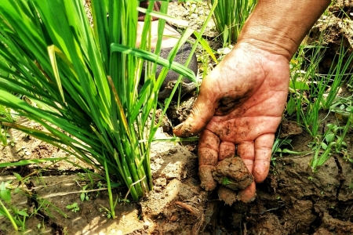

```{r setup, include=FALSE}
knitr::opts_chunk$set(echo = TRUE)
```

```{r}

```

# Introduction

Berdasarkan
[laporan](https://www.bps.go.id/indicator/53/23/1/produksi.html) Badan
Pusat Statistika (BPS) produksi Gabah Kering Giling (GKG) Indonesia
mencapai 83 juta ton pada tahun 2018, jika dikonversi menjadi beras maka
akan didapatkan angka 53 juta ton produksi beras (64,02% konversi dari
GKG). Pada
[laporan](https://www.bps.go.id/publication/2019/06/25/bbf8ec1716fb4583687996c3/kajian-konsumsi-bahan-pokok-tahun-2017.html)
yang berbeda oleh BPS, konsumsi beras tahunan per kapita adalah 11,58
kg. Ini berarti untuk 2018 kebutuhan beras nasional sebesar 30 juta ton.

Akan digunakan metode **forecasting time series** untuk memprediksi
jumlah **produksi beras** kedepannya dalam rangka membandingkan dengan
*kebutuhan beras nasional*. Hasil forecasting yang dilakukan dapat
menjadi salah satu acuan dalam membuat kebijakan mengenai manajemen stok
beras di tingkat nasional baik untuk melakukan ekspor ataupun import
beras.

# Data Wrangling dan Eksplorasi Data

## Packages

```{r message=FALSE, warning=FALSE} 
library(ggplot2)
library(forecast)
library(tseries) 
library(dplyr)
library(MLmetrics)
library(TSstudio)
library(plotly)
```

## Dataset

Dataset dapat diunduh di
[sini](https://docs.google.com/spreadsheets/d/17xam21S9PaFIwe-2GwPDbdgXcNGSfT3RudWIiwss48o/edit?usp=sharing)

```{r}
beras <- read.csv("Produksi Gabah Kering Giling.csv")

rmarkdown::paged_table(beras)
```

```{r}
# Mengurutkan Tahun
beras <- beras %>%
  dplyr::arrange(Tahun)

# Menampilkan informasi dari setiap kolom
glimpse(beras)
```

Deskripsi kolom:

**`Tahun`**: Tahun produksi padi, dari 1993 hingga 2018.

**`Produksi_GKG`**: Jumlah produksi padi (bentuk Gabah Kering Giling)
dalam satuan Ton (1000 kg) di Indonesia. [sumber
BPS](https://www.bps.go.id/indicator/53/23/1/produksi.html)

**`Produksi_Beras`**: Jumlah produksi beras dalam satuan ton, angka ini
didapatkan dengan konversi 64,03% dari `Produksi_GKG` [sumber
BPS](https://www.bps.go.id/publication/2019/06/25/bbf8ec1716fb4583687996c3/kajian-konsumsi-bahan-pokok-tahun-2017.html)

**`Konsumsi_Beras_Perkapita`** : Konsumsi beras tahunan kg/kapita
[sumber
BPS](https://www.bps.go.id/publication/2019/06/25/bbf8ec1716fb4583687996c3/kajian-konsumsi-bahan-pokok-tahun-2017.html)

**`Jumlah_Penduduk`** : Jumlah penduduk Indonesia per tahun [sumber Bank
Dunia](https://data.worldbank.org/indicator/SP.POP.TOTL?locations=ID)

**`Total_Konsumsi_Beras`**: Total konsumsi beras nasioanal. Nilai
didapatkan dari hasil perkalian antara **`Konsumsi_Beras_Perkapita`**
dengan **`Jumlah_Penduduk`**.

Selanjutkan kita akan melakukan pengecekan terhadap missing value.

```{r}
anyNA(beras)
```

Karena tidak adanya data yang hilang, akan dilakukan pembentukan time
series.

# Data Preprocessing

## Pembuatan Objek Time Series

Dataframe **`beras`** akan dibentuk menjadi time series kemudian
dimasukkan ke dalam objek **`beras_ts`**. Pembentukan time series ini
berguna untuk melakukan dekomposisi serta pengolahan lebih lanjut dalam
prediksi time series ini. `frequency` di-define menjadi 3 untuk melihat
**pola per 3 tahun**.

```{r}
beras_ts <- ts(data = beras$Produksi_Beras,
             start = 1993,
             frequency = 3)

autoplot(beras_ts)
```

Seperti yang terlihat dari hasil plot bahwa: 1. Trend mengalami
kenaikan, yang berarti setiap tahunnya produksi beras mengalami
peningkatan setiap tahunnya. 2. Termasuk jenis additive time series
karena peningkatan dan penurunan yang konstan untuk setiap 3 tahunnya.

## Dekomposisi

Setelah itu dilakukan **decompose** data untuk memecah data ts menjadi 3
komponen (trend, seasonality, error).

1.  Trend: Pola data secara umum, apakah mengalami kenaikan atau
    penurunan
2.  Seasonality: Pola berulang dengan periode waktu yang tetap
3.  Error: Komponen lain yang tidak tertangkap oleh Trend dan
    Seasonality.

Hal ini untuk memastikan pola trend dan seasonal sudah ditangkap dengan
baik dan frequency yang kita gunakan sudah tepat.

```{r}
# decompose
beras_ts %>%
  stats::decompose() %>%
  autoplot()
```

Dari hasil *decompose* ini, didapatkan insight bahwa:

-   Trend produksi GKG naik secara konstan serta trend yang smooth.
-   Terdapat 8 pola pada seasonal: yaitu pola berulang setiap 3 tahun
    dari tahun 1993 hingga 2018.
-   Error tertangkap dan terlihat error di pola random di titik-titik
    tertentu.

## Cross Validation

Dilakukan *cross validation* untuk membagi dataset menjadi
**`beras_train`** sebagai data latih dan **`beras_test`** data test.
Data test bertujuan untuk mengetahui seberapa baik model dalam
memprediksi data yang belum pernah dilihat dalam pelatihan
(generalisasi)

Dalam kasus ini data test diambil sebanyak 6 sampel berhubung
keseluruhan data hanya berjumlah 26.

```{r}
beras_train <- head(beras_ts, n = length(beras_ts) - 6)
beras_test <- tail(beras_ts, n = 6)
```

```{r}
length(beras_train)
```

```{r}
length(beras_test)
```

# Modelling

Dalam pembangunan model. Digunakan Holt Winters dan Seasonal ARIMA
(SARIMA). Digunakannya Holt Winters karena data yang digunakan memiliki
trend dan juga seasonal. Untuk perbandingan, akan digunakan SARIMA untuk
melihat apakah SARIMA dapat memberikan performa yang lebih baik.

## Holt Winters

```{r}
# Holt-Winters
model_holtwin <- HoltWinters(x = beras_train, seasonal = "additive")

# forecasting model holtwinters untuk 6 tahun kedepan
close_holtwin_f <- forecast(model_holtwin, h = 6)
```

Visualisasi data aktual dan juga data prediksi menggunakan model Holt
Winters

```{r}
# cara visualisasi lain: perbandingan prediksi dan aktual
test_forecast(actual = beras_ts, # data aktual full
              forecast.obj = close_holtwin_f, # hasil forecast
              test = beras_test) # data test
```

Dapat terlihat bahwa hasil prediksi dapat mengikuti pola trend untuk
data test

```{r}
autoplot(beras_ts) +
  autolayer(close_holtwin_f) + 
  autolayer(beras_test, series = "Data Aktual") + 
  theme_light()
```

Grafik di atas melakukan visualisasi terhadap kemungkinan prediksi
rata-rata, high serta low dari hasil prediksi Holt Winters. Garis merah
sebagai data test aktual. Area berwarna biru merupakan 80% interval
prediksi sedangkan area berwarna biru cerah merupakan 95% interval
prediksi. Seluruh data aktual masih berada di dalam area interval
prediksi.

## SARIMA

```{r}
# SARIMA
close_arima <- stlm(beras_train, method = "arima")
```

Melakukan prediksi terhadap 6 tahun kedepan dari data latih.

```{r}
# forecasting model arima
close_arima_f <- forecast(close_arima, h = 6)
```

Visualisasi dan perbandingan hasil prediksi ARIMA terhadap data test

```{r}
# cara visualisasi lain: perbandingan prediksi dan aktual
test_forecast(actual = beras_ts, # data aktual full
              forecast.obj = close_arima_f, # hasil forecast
              test = beras_test); # data test
```

Dapat dilihat bahwa hasil fitting dan prediksi telah dapat mengikuti
trend untuk data test

```{r}
autoplot(beras_ts) +
  autolayer(close_arima_f) +
  autolayer(beras_test, series = "Data Aktual") + 
  theme_light()
```

Grafik di atas melakukan visualisasi terhadap kemungkinan prediksi
rata-rata, high serta low dari hasil prediksi SARIMA. Garis merah
sebagai data test aktual. Area berwarna biru merupakan 80% interval
prediksi sedangkan area berwarna biru cerah merupakan 95% interval
prediksi. Seluruh data aktual masih berada di dalam area interval
prediksi.

# Evaluasi Model

Evaluasi terhadap model yang telah dibangun. Model terbaik akan
dilakukan tuning dan juga akan dilakukan uji asumsi.

```{r}
eval <-
  rbind(
    accuracy(as.vector(close_arima_f$mean), beras_test),
    accuracy(as.vector(close_holtwin_f$mean), beras_test)
    )

rownames(eval) <- c("SARIMA", "HoltWinters")
eval
```

Dari hasil evaluasi di atas, dapat disimpulkan bahwa model telah dapat
memprediksi produksi beras nasional. Adapun model terbaik adalah Holt
Winters dengan nilai error terkecil (MAE 2,131,829, berarti rentang
kesalahan data prediksi terhadap data aktual senilai +- 2,131,829)

# Tuning

Dalam kasus ini, Holt Winters menjadi model terbaik. Maka dari itu
dicoba dilakukan tuning dalam meningkatkan performa model Holt Winters.
Adapun tuning yang akan dilakukan yaitu dengan mengubah paramater
`alpha`, `beta`, dan `gamma`

Sebelum itu, mari kita lihat `alpha` `beta` `gamma` dari model Holt
Winters kita sebelumnya (yang diinisiasi auto)

```{r}
model_holtwin
```

Terlihat bahwa nilai: Untuk error, yaitu **`alpha`**: 0.6741372 Untuk
trend, yaitu **`beta`**: 0.1356548 Untuk seasonal, yaitu **`gamma`**:
0.8887752

Kemudian dilakukan uji coba terhadap **`beta`**. Dalam hal ini,
**`beta`** akan ditingkatkan sebesar 0.1 sebanyak 3 kali, kemudian akan
dibandingkan performa terhadap masing-masing model yang telah dituning.

```{r}
model_holtwin2 <- HoltWinters(x = beras_train, beta = 0.2)
model_holtwin3 <- HoltWinters(x = beras_train, beta = 0.3)
model_holtwin4 <- HoltWinters(x = beras_train, beta = 0.4)

close_holtwin_f2 <- forecast(model_holtwin2, h = 6)
close_holtwin_f3 <- forecast(model_holtwin3, h = 6)
close_holtwin_f4 <- forecast(model_holtwin4, h = 6)
```

```{r}
eval_tuning <-
  rbind(
    accuracy(as.vector(close_holtwin_f$mean), beras_test),
    accuracy(as.vector(close_holtwin_f2$mean), beras_test),
    accuracy(as.vector(close_holtwin_f3$mean), beras_test),
    accuracy(as.vector(close_holtwin_f4$mean), beras_test)
    )

rownames(eval_tuning) <- c("HoltWin", "HoltWin_b0.2", "HoltWin_b0.3", "HoltWin_b0.4")

eval_tuning
```

Dari hasil tuning, didapatkan bahwa HoltWinters dengan nilai **`beta`**
sebesar `0.4` memiliki performa yang paling baik. MAE sebelum dituning
bernilai 2.141.829 (dua juta seratus ribuan) sedangkan MAE setelah
dituning bernilai 1.009.583 (satu juta sembilan ribuan).

Interpretasi dari hasil MAE ini yaitu bahwa simpangan error yaitu
+-1.009.583 terhadap data aktual.

Adapun range data aktual yaitu:

```{r}
range(beras$Produksi_Beras)[2] - range(beras$Produksi_Beras)[1]
```

Jika rata-rata error dibagi dengan range total data aktual maka, range
error yang dihasilkan berkisar +- 4.2% terhadap range data aktual.

Berikut adalah detail dari model terbaik serta visualisasi terhadap data
aktual.

```{r}
model_holtwin4
```

```{r}
# cara visualisasi lain: perbandingan prediksi dan aktual
test_forecast(actual = beras_ts, # data aktual full
              forecast.obj = close_holtwin_f4, # hasil forecast
              test = beras_test) # data test
```

```{r}
autoplot(beras_ts) +
  autolayer(close_holtwin_f4) + 
  autolayer(beras_test, series = "Data Aktual") + 
  theme_light()
```

Dapat terlihat pada grafik, model Holt Winters yand telah dituning lebih
dapat mengikuti pola trend terhadap data test. Kemudian semua data
aktual berada di dalam interval prediksi 80%. Ini lebih baik dari model sebelum dituning yang dimana data aktual masih terdapat di dalam area interval prediksi 95%.

# Uji Asumsi

## Normality of Residual

-   H0: Residual/error berdistribusi normal (yang diinginkan)

-   H1: Residual tidak berdistribusi normal

Dilakukan pengecekan terhadap distribusi error apakah distribusi error
normal atau tidak (diharapkan error berada di sekitar angka nol)

```{r}
shapiro.test(close_holtwin_f4$residuals) # p-value < 0.05 maka H1
```

Residual berdistribusi normal karena p-value \> 0.05, sehingga tolak H1.
Asumsi terpenuhi.

Berikut adalah distribusi residual pada model **model_holtwin4**

```{r}
hist(close_holtwin_f4$residuals)
```

## No Autocorrelation on Residuals

-   H0: Residual tidak mengalami autokorelasi (yang diinginkan)

-   H1: Residual mengalami autokorelasi

```{r}
Box.test(close_holtwin_f4$residuals, type = "Ljung-Box")
```

p-value \> 0.05, H1 tertolak sehingga Residual tidak mengalami
autokorelasi (asumsi terpenuhi)


# Perbandingan Produksi dengan Konsumsi Beras

Akan dilakukan prediksi terhadap tingkat produksi beras dengan tingkat
konsumsi beras nasional hingga tahun 2024.

```{r}
# Mengubah Total Konsumsi Beras menjadi tipe time series
konsumsi <- ts(beras$Total_Konsumsi_Beras,
               start = 1993,
               frequency = 3)
```

```{r}
# Membuat model forecasting untuk data konsumsi beras tahunan Indonesia
model_holtwin_konsumsi <- HoltWinters(x = konsumsi, seasonal = "additive")

# Melakukan prediksi untuk 6 tahun ke depan (2018-2024)
konsumsi_holtwin_f <- forecast(model_holtwin_konsumsi, h = 6)

# Melakukan prediksi untuk 12 tahun kedepan (2012-2024)
close_holtwin_f5 <- forecast(model_holtwin4, h = 12)
```

```{r}
plot_prediksi <- beras_train %>% 
  autoplot()+
  autolayer(beras_test, series = "test")+
  autolayer(konsumsi, series = "konsumsi") +
  autolayer(konsumsi_holtwin_f$mean, series = "konsumsi forecast") +
  autolayer(model_holtwin4$fitted[,1], series = "fitted_ets")+
  autolayer(close_holtwin_f5$mean, series = "forecast_ets")

ggplotly(plot_prediksi);
```

Pada grafik ini, produksi beras nasional masih melebihi tingkat konsumsi
beras tahunan nasional hingga tahun 2024.

# Kesimpulan

1.  Model terbaik dalam memprediksi data produksi beras adalah Holt
    Winters dibandingkan dengan Arima. Model Holt Winters hasil tuning
    terhadap trend dan seasonal juga menunjukkan peningkatan akurasi
    yang baik.
2.  Model Tuned Holt Winters memenuhi uji asumsi terhadap distribusi
    residual yang normal dan juga tidak adanya autokorelasi terhadap
    residual.
3.  Berdasarkan data historikal dan juga hasil forecasting. Produksi
    beras nasional masih melebihi rata-rata konsumsi beras nasional baik
    dari tahun 1993 hingga 2024.

# Rekomendasi

Model serta preprocessing yand digunakan masih tergolong sederhana.
Dapat dilakukan preprocessing yang lebih kompleks serta analisis data
time series lanjutan. Selain itu data yang digunakan juga tergolong
sedikit (keterbatasan mendapatkan data) sehingga saran kedepannya untuk
memperbanyak data. Selain itu, terdapat beberapa inkonsistensi data
antara kementerian dengan BPS khususnya mengenai produksi gabah kering
giling sebelum tahun 2016. Maka dari itu perlu juga dilkaukan verifikasi
data.
